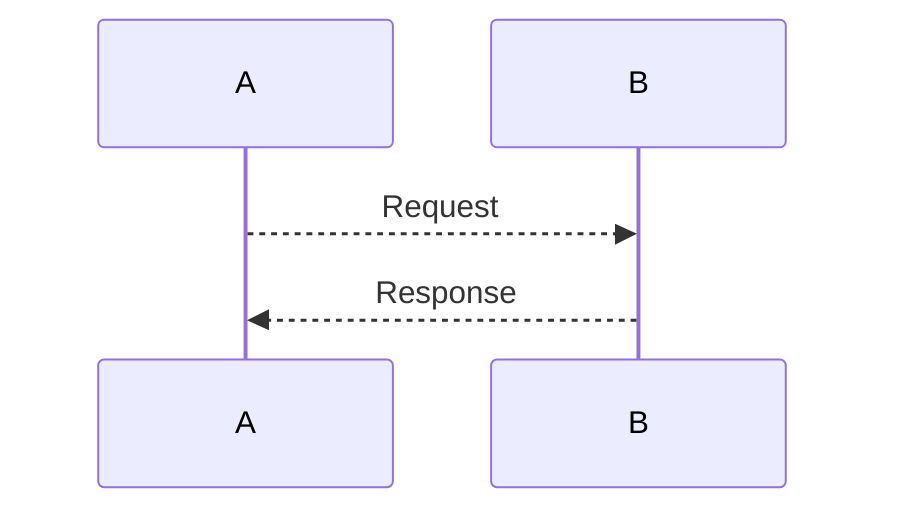

- Create git repo
  - mkdir `projectName`
  - cd `projectName`
  - git init
  - touch `README.md`
  - git add `README.md`
  - git commit -m `Create Repo`

---

- Create GitBub Repo
  - `curl` -i -u '`userName`':$GITHUB_TOKEN https://api.github.com/user/repos -d `'{"name": "Type Script Project", "description": "Boiler plate Typescript Project"}`'

- Git REST API
  - https://docs.github.com/en/rest/guides/getting-started-with-the-rest-api

---

- Add Remote Origin
  - `git remote add origin` git@github.com:`userName`/Type-Script-Project.git
  - `git push origin master`

---

- Mermaid diagram https://github.com/mermaid-js/mermaid/blob/develop/docs/sequenceDiagram.md


---

- Install Typescript
  - `npm install typescript@latest --save-dev`

- Add `.gitignore`
  - touch .gitignore
  ```
    #Npm
    node_modules

    #Build
    build
  ```

- Create `src` directory and main entry
  - `mkdir src`
  - `cd src`
  - `touch main.ts`
  ```
  const helloWorld = () => {
    console.log('Hello world');
  }

  helloWorld();
  ```

- Create `tsc` compile script
  - `package.json`
  ```
  { 
    "scripts": {
      "build": "tsc"
      "buildw": "tsc --watch"
    }
  }
  ```
  - run compilation `npm run tsc`
  - observe generation of `build/main.js`
  - run compiled app `node ./build/main.js`

- Create `node run` script
  - `package.json`
  ```
  {
    "scripts": {
      "run-node": "node ./build/main.js"
    }
  }
  ```

- Install `webpack`
  - `npm install webpack@latest webpack-cli@latest --save-dev`
  - Create `webpack.config.js`
  ```
  const path = require('path');

  module.exports = {
    entry: './src/main.ts',
    output: {
        filename: 'main.js',
        path: path.resolve(__dirname, 'public'),
    }
  }
  ```

- Create `public/index.html`
  - `mkdir public`
  - `cd public`
  - `touch index.html`
  ```
  <!DOCTYPE html>
  <html>
      <head>
          <meta charset="utf-8" />
          <title>Typescript Boilerplate project</title>
      </head>
      <body>
          <script src="main.js"></script>
      </body>
  </html>
  ```