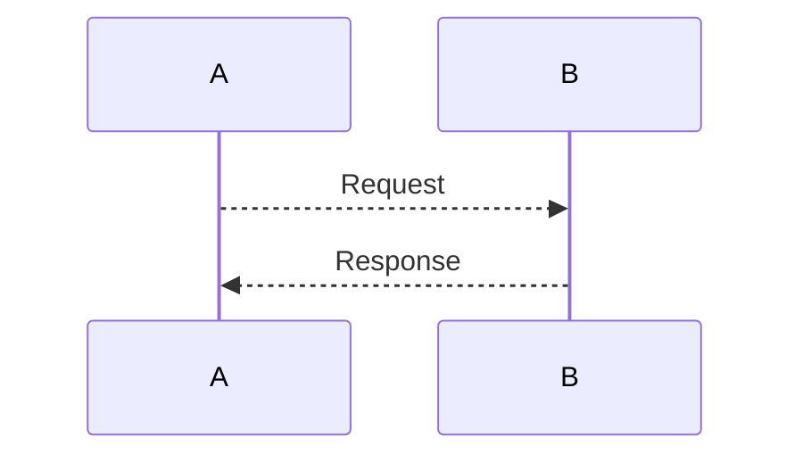

- Create git repo
  - mkdir `projectName`
  - cd `projectName`
  - git init
  - touch `README.md`
  - git add `README.md`
  - git commit -m `Create Repo`

---

- Create GitBub Repo
  - `curl` -i -u '`userName`':$GITHUB_TOKEN https://api.github.com/user/repos -d `'{"name": "Type Script Project", "description": "Boiler plate Typescript Project"}`'

- Git REST API
  - https://docs.github.com/en/rest/guides/getting-started-with-the-rest-api

---

- Add Remote Origin
  - `git remote add origin` git@github.com:`userName`/Type-Script-Project.git
  - `git push origin master`

---

- Mermaid diagram https://github.com/mermaid-js/mermaid/blob/develop/docs/sequenceDiagram.md


---

- Install Typescript
  - `npm install typescript@latest --save-dev`

- Add `.gitignore`
  - touch .gitignore
  ```
    #Npm
    node_modules

    #Build
    build
  ```

- Create `src` directory and main entry
  - `mkdir src`
  - `cd src`
  - `touch main.ts`
  ```
  const helloWorld = () => {
    console.log('Hello world');
  }

  helloWorld();
  ```

- Create `tsc` compile script
  - `package.json`
  ```
  { 
    "scripts": {
      "build": "tsc"
      "buildw": "tsc --watch"
    }
  }
  ```
  - run compilation `npm run tsc`
  - observe generation of `build/main.js`
  - run compiled app `node ./build/main.js`

- Create `node run` script
  - `package.json`
  ```
  {
    "scripts": {
      "run-node": "node ./build/main.js"
    }
  }
  ```

- Install `webpack`
  - `npm install webpack@latest webpack-cli@latest --save-dev`
  - https://webpack.js.org/guides/getting-started/
  - Create `webpack.config.js`
  ```
  const path = require('path');

  module.exports = {
    entry: './src/main.ts',
    output: {
        filename: 'main.js',
        path: path.resolve(__dirname, 'public'),
    }
  }
  ```
  - Add `webpack` build scripts
  ```
  {
    "scripts": {
      "webpack": "webpack --mode=development",
      "webpackw": "webpack --mode=development --watch"
    }
  }
  ```

- Create `public/index.html`
  - `mkdir public`
  - `cd public`
  - `touch index.html`
  ```
  <!DOCTYPE html>
  <html>
      <head>
          <meta charset="utf-8" />
          <title>Typescript Boilerplate project</title>
      </head>
      <body>
          <script src="main.js"></script>
      </body>
  </html>
  ```

- Install `open-cli` to run html localy
  - `npm install open-cli --save-dev`
  - Update `open-cli` script
  ```
  {
    "scripts": {
      "run-html": "open-cli ./public/index.html"
    }
  }
  ```

- Install `serve` to run static files locally
  - `npm install serve@latest --save-dev`
  - Update `serve` script
  ```
  {
    "scripts": {
      "serve": "serve ./public"
    }
  }
  ```

- Install `ts-loader` to load packages with webpack
  - `npm install ts-loader@latest --save-dev`
  - Add configuration to `webpack.config.js`
  ```
  module.exports = {
    ...
    // loaders
    module: {
      rules: [
        {
          test: /\.tsx?/,
          use: 'ts-loader',
          exclude: /node_modules/,
        }
      ]
    }
  }
  ```

- Update `webpack.config.js` to support better source map generation
  - Add `devtool: "source-map"`
  ```
  module.export = {
    ...
    devtool: "source-map"
  }
  ```

- Add support for independent `packages` | `modules` for the project
  - Create `packages` folder to support packages
  - Create `utils` demo package.
  - Create `package.json`
  ```
  {
    "name": "@packages/utils",
    "private": true
  }
  ```
  - Add support for arbitrary pacakges to project `package.json`
  ```
  {
    ...
    "workspaces": [
      "packages/**"
    ]
  }
  ```
  - Add dependencies for `packages/utils` to project
  ```
  {
    "dependencies": {
      "@packages/utils": "*"
    }
  }
  ```
- Add support for building typescript `gcc` style, using `@vercel/ncc` compiler
  - https://www.npmjs.com/package/@vercel/ncc
  - `npm install @vercel/ncc --save-dev`
  - Update `package.json` build scripts
  ```
  {
    ...
    "ncc": "ncc build -s --no-source-map-register ./src/main.ts -o ./build/"
  }
  ```

- Add support for generating template `html-webpack-plugin`
  - `npm install html-webpack-plugin@latest --save-dev`
  ```
  const HtmlWebpackPlugin = require('html-webpack-plugin');
  
  ...

  module.exports = {
    ...
    plugins: [
      new HtmlWebpackPlugin({
        title: 'Typescript Boilerplate project',
        filename: 'index.html'
      })
    ]
  }
  ```

- Add support for css/scss/sass
  - `npm install css-loader style-loader sass-loader node-sass --save-dev`
  ```
  module.exports = {
    ...

    module: {
      rules: [
        {
          test: /\.(s(a|c)ss)$/,
          use: ['style-loader', 'css-loader', 'sass-loader']
        }
      ]
    }
  }
  ```

- Add support for loading url resource/fonts/images with `url-loader`
  - https://google-webfonts-helper.herokuapp.com/fonts/open-sans?subsets=latin
  - https://dev.to/deepanjangh/setting-up-css-and-sass-with-webpack-3cg
  - `npm install url-loader@latest --save-dev`
  ```
  module.exports = {
    ...

    module: {
      rules: [
        {
          test: /\.(woff|woff2|eot|ttf|svg|jpg|png)$/,
          use: {
            loader: 'url-loader'
          }
        }
      ]
    }
  }
  ```
- Add support for `webpack` server
  - `npm install webpack-dev-server@latest --save-dev`
  - https://www.npmjs.com/package/webpack-dev-server
  ```
  module.exports = {
    ...

    devServer: {
      static: {
        directory: path.join(__dirname, 'public')
      },
      compress: false,
      port: 9000
    }
  }
  ```
  - Update `package.json` scripts
  ```
  {
    ...
    
    "scripts": {
      "serve-w": "webpack serve"
    }
  }
  ```