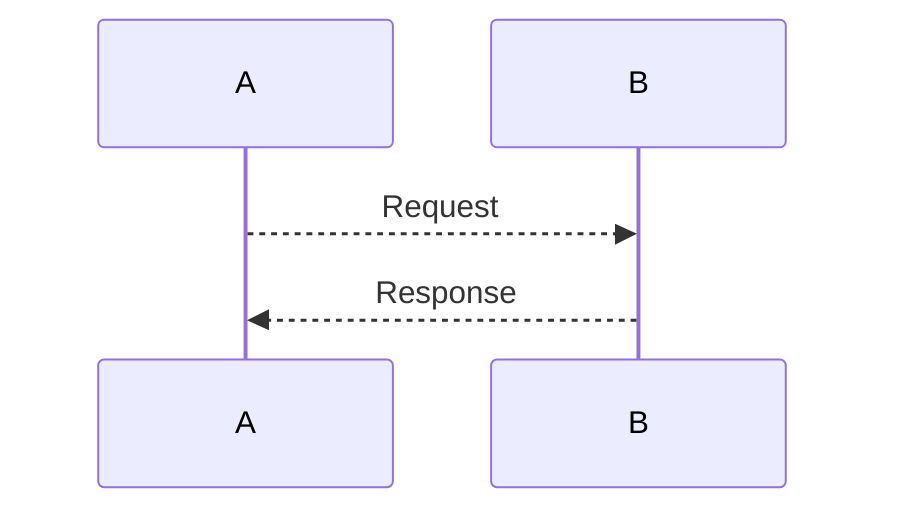

- Create git repo
  - mkdir `projectName`
  - cd `projectName`
  - git init
  - touch `README.md`
  - git add `README.md`
  - git commit -m `Create Repo`

---

- Create GitBub Repo
  - curl -i -u '`userName`':$GITHUB_TOKEN https://api.github.com/user/repos -d `'{"name": "Type Script Project", "description": "Boiler plate Typescript Project"}`'

---

- Add Remote Origin
  - git remote add origin git@github.com:`userName`/Type-Script-Project.git
  - git push origin master

---

- Mermaid diagram https://github.com/mermaid-js/mermaid/blob/develop/docs/sequenceDiagram.md

---